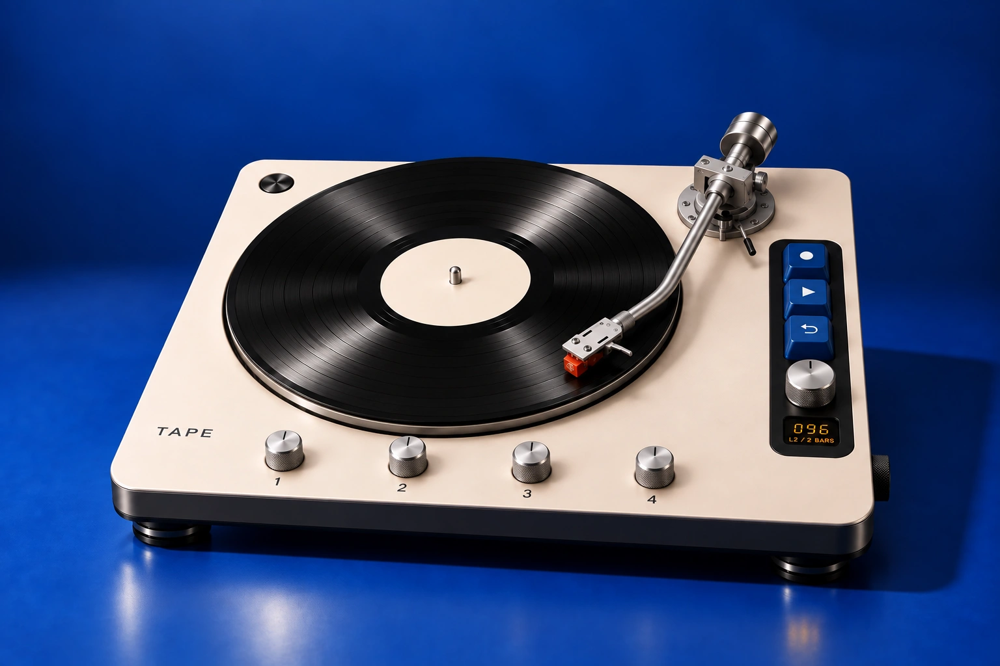

# TAPE

**Touch. Play. Repeat.** A four-layer loop instrument you can play in your browser, and an open development study for the physical T—01 Session Deck.



Built by [Ethan](https://x.com/ethanplusai). Product images are generated concept imagery. The web audio demo works; the physical instrument is not in production, and this project takes no orders or payments.

## Run locally

Requires Node.js 22 or newer.

```sh
npm ci
npm run build
npm start
```

Open **http://127.0.0.1:4293**. Audio requires HTTPS or localhost. The audio engine has no runtime dependencies. Production page analytics uses the official Vercel Analytics SDK. No API keys, database or accounts are needed to run the deck.

## Play

1. Press the blue **Play** key, or the hero's **Play the deck** button. Layer 1 starts with drums; layer 2 is selected. No microphone is needed to play.
2. Press the main dial and open **SOUND**. Choose **BASS**, then **ROUND**, and press to load a bass line into layer 2.
3. Press a bottom dial to choose a layer, turn it to mix, or hold it to mute.
4. Turn the main dial for BPM. **Press** opens a menu; **turn** browses; **press** enters or confirms. Hold or Escape goes back.
5. **SOUND** offers twelve original loops across DRUMS, BASS, CHORDS and TEXTURE. Choose OFF to empty the selected layer. Changes join at the next bar during playback. Only the selected layer changes.
6. Optionally press **Record**, allow your mic and add a take. Use headphones for overdubbing to avoid recording the speakers. Replacing a mic recording with a library sound asks for confirmation.
7. Drag the disc in either direction to scrub a layer. Sweep the arm inward to filter it. Release the disc to rejoin the timeline.
8. **SESSION → SAVE** downloads an editable `.tape` project. **EXPORT** downloads a mixed WAV. Save before reloading.

**Learn the controls** opens a nine-part photographic guide. Choose a feature, then **Find this on the deck** to enlarge its control or open its menu in the hero. Browsing the guide never starts audio, requests the mic or changes your recordings.

Use **Inspect controls** and **Layers** to enlarge the product. Keyboard users can Tab to controls, use arrows to turn, Enter to press and Shift+Enter to hold. [Complete controls and limitations](docs/controls.md).

ROOM 01 is one two-bar collection, written in A minor at 96 BPM. Every part uses the same native tempo, so library sounds stay in tune with each other when the deck changes speed. The library is original deterministic synthesis, not an AI music-generation service. [Library design and limitations](docs/sound-library.md).

## Privacy

Mic audio stays in browser memory. It is never uploaded, logged or transmitted by this application. Mic access ends after a take, cancellation, standby or hiding/leaving the tab. Projects and WAV files download directly to your device. Reloading loses unsaved work. The disc animates on arrival; sound and microphone access require a user action.

Vercel Web Analytics collects basic page views in production. It does not receive microphone audio, saved sessions, filenames or musical control events. Page URLs have query strings and fragments removed before analytics submission. Local development and preview builds do not load analytics. There is no advertising, account system or audio backend. Ordinary hosting access logs are controlled by the host. The build-updates link opens Ethan's separate newsletter site, where its own signup flow applies.

## Check the work

```sh
npm test
npm run audit:public
npm run build
npx playwright install chromium
# In another terminal: npm start
npm run test:browser
npm run test:guide
npm run test:library
```

Audio startup tests cover gesture timing and cancelled microphone permission. The guide suite checks every feature link, narrow-screen layout, motion controls and deliberately delayed processor loading. See [browser audio validation](docs/browser-audio.md) for Safari coverage and its limits.

DSP tests measure PCM capture, overdub/undo, tempo, amplitude, reverse, filtering and scrubbing. Project tests validate round-tripping and malformed input. Browser tests use a **synthetic microphone**, real pointer/touch interactions and the actual AudioWorklet, and write ignored screenshots to `test-results/`.

A synthetic input test is not a physical microphone latency or sound-quality measurement. Test representative phones, headphones and interfaces before relying on the demo for performance.

## Product research

- [Engineering and manufacturing study](docs/hardware/research.md)
- [Supplier brief and validation gates](docs/hardware/rfq.md)
- [Cost inputs](docs/hardware/cost-inputs.json) and [calculated scenarios](docs/hardware/cost-results.csv)
- [Visual assembly and reference consistency](docs/design/assembly.md)

```sh
npm run hardware:model
```

The $1,999 working price and 500-unit scenario are assumptions, not a fixed offer. The cost study distinguishes manufacturer specifications from unquoted allowances. No supplier has been contacted and no physical performance has been validated.

## Structure

```text
public/tape-audio/   Sample-clock DSP, AudioWorklet, local file formats and original presets
public/product/      Approved photographic product layers
public/*.css         TAPE styling and fixed photographic projections
public/tape-session.js  Physical controls, menus, audio lifecycle and motion
scripts/             Static build, development server, audit and cost calculations
tests/               PCM, file-format, cost-model and browser checks
docs/                Controls, design assembly and physical-product research
```

`dist/` is generated. The build copies `public/` and `docs/`; everything in those directories is public. Do not put credentials, recordings, private correspondence or working notes there.

## Deploy

The included `vercel.json` builds a static site with `npm run build` and serves `dist/`. Create a dedicated Vercel project from this repository. The build uses Vercel’s production-domain variable for canonical, social-image and sitemap URLs. Set `SITE_ORIGIN` to override it, or when deploying to another host. A custom domain also needs the DNS record Vercel supplies. The site can run on any HTTPS static host with JavaScript module MIME types.

Enable Web Analytics for this project in Vercel before deploying the analytics integration. The static build copies the official SDK and passes Vercel’s optional observability client configuration into it. The SDK loads the project’s same-origin analytics script; no analytics credential is embedded.

## Contributions and licensing

See [CONTRIBUTING.md](CONTRIBUTING.md) for the visual and audio invariants. Source code and original synthesized preset code are MIT licensed. TAPE branding, product imagery and other creative assets are excluded from that license; see [ASSETS.md](ASSETS.md). Font licenses are included with the font files. Hardware documentation is a concept study, not an open-hardware manufacturing release.
